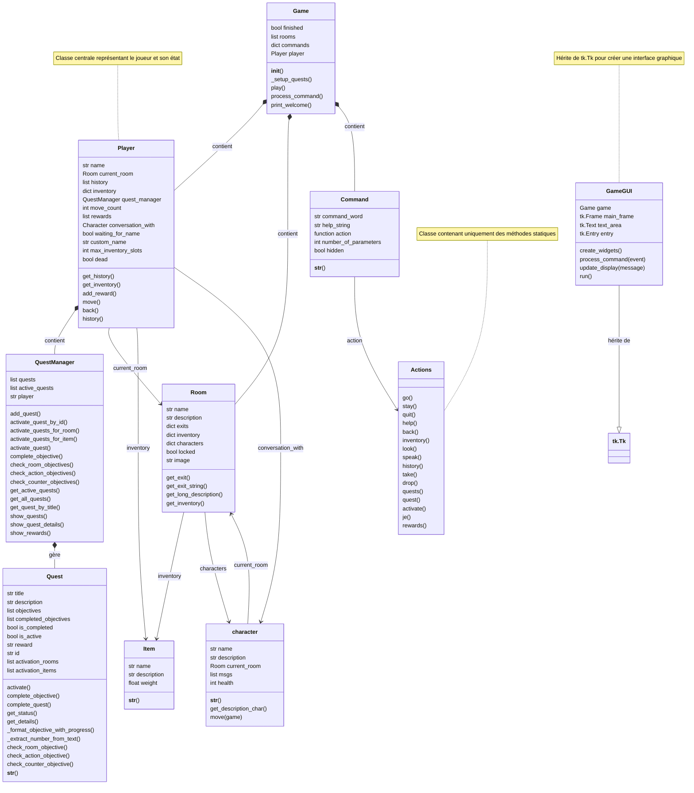

# UpsideDownRace : 

Une course d'orientation intercative à l'ESIEE où vous devez explorer les lieux et accomplir des quêtes pour vous familiariser avec l'école ! 
Mais attention à ne pas se faire attraper par le Démogorgon!
## Description

**UpsideDownRace**  est un jeu d'aventure  immersif où vous incarnez un élève qui participe à une course d'orientation. Votre mission : suivre les étapes de la fiche de la course d'orientation et être prêt à ce que l'impossible survienne.

**État actuel du projet :**
- **Plusieurs lieux explorables** (Salles, Couloirs, Parking, Jardin, Rue, Cafétéria, Club Musique, etc.)
- 🧭 Navigation par directions cardinales (N, E, S, O)
- Système de **quêtes** avec objectifs progressifs et récompenses
- **Démogorgon** qui se déplace aléatoirement et vous chasse
- Système d'**inventaire** complet avec **items** à collecter et utiliser
- Porte verrouillée nécessitant une **clé** pour progresser
- **PNJ** dialoguants (Jean Bomber à la Cafétéria)
- Combat avec le Démogorgon pour la victoire finale

**Objectif principal:** Visiter les lieux et.. tuer le monstre qui vous pourchasse !

## Lancement du jeu

Pour démarrer votre course d'orientation :

```bash
python game.py
```

Entrez votre nom quand demandé et explorez l'ESIEE!

## Lieux Explorables

La course d'orientation se déroule dans les lieux suivants:

| Lieu | Description |
|------|-------------|
| **Salle 1** | Point de départ - Récupérez les **consignes** ici! |
| **Couloir 1 & 2** | Zones de transit |
| **Salle 2** | Salle verrouillée contenant une **carte du Jardin** |
| **Salle 3** | Salle dans laquelle un élève prénomé Louis avait oublié son jogging rouge style années 80 il y a quelques années  |
| **Jardin** | Lieu caché où se cache l'**épée** |
| **Rue** | Zone dangereuse où le **Démogorgon spawn** |
| **Cafétéria** | Rencontrez **Jean Bomber (PNJ)** |
| **Club Musique** | Lieu clé - Contient la **clé pour Salle 2** |
| **Escaliers 1 & 2** | Passages verticaux |
| **Parking & Parking 2** | Zones d'exploration - **bouclier** disponible |
| **Marcel Dassault** | Salle supplémentaire (easter egg) |

## Commandes Disponibles

### Navigation & Exploration
- `go <direction>` : Se déplacer (N, E, S, O)
- `look` : Regarder autour (voir items et PNJ)
- `history` : Voir les pièces visitées
- `back` : Revenir en arrière

### Gestion d'Inventaire
- `check` : Afficher votre inventaire
- `take <item>` : Prendre un item dans la pièce
- `drop <item>` : Laisser un item

### PNJ & Interaction
- `speak <nom_pnj>` : Parler à un PNJ pour écouter ses messages

### Quêtes
- `quests` : Voir toutes les quêtes disponibles
- `quest <titre>` : Voir les détails d'une quête spécifique  
- `activate <num>` : Activer une quête (utiliser le numéro)
- `rewards` : Afficher vos récompenses gagnées

### Autre
- `stay` : Rester sur place (fait progresser le monde)
- `help` : Afficher l'aide
- `quit` : Quitter le jeu

## Système de Quêtes

Le système de quêtes vous guide à travers la course d'orientation:

- **Quêtes activables** : Découvrez-les en explorant
- **Objectifs progressifs** : Chaque quête a plusieurs étapes
- **Suivi automatique** : Vos progrès se mettent à jour au fil de vos actions
- **Récompenses** : Gagnez des bonus en complétant les quêtes
- **Activation automatique** : Certaines quêtes s'activent en visitant des lieux clés

**Types d'objectifs :**
- **Objectifs de visite** : Visiter des lieux spécifiques
- **Objectifs de compteur** : Accomplir des actions un certain nombre de fois (ex: explorer 5 pièces)
- **Objectifs d'items** : Collecter des objets essentiels

## Items Clés

Voici les items importants à trouver:

| Item | Localisation | Utilité |
|------|-------------|---------|
| **consignes** | Salle 1 | Informations sur la course - OBLIGATOIRE pour quitter |
| **clé** | Club Musique | Déverrouille la Salle 2 |
| **carte** | Salle 2 | Montre l'emplacement de l'épée dans le Jardin |
| **épée** | Jardin | Arme pour combattre le Démogorgon! |
| **bouclier** | Parking | Protection supplémentaire |
| **sac** | Parking 2 | Contient le monster_tracker (révèle la position du monstre) |
| **monster_tracker** | Dans le sac | Vous permet de tracker le Démogorgon |

## Le Démogorgon 

**Ennemi principal du jeu:**

- Spawne dans la **Rue** quand vous entrez au Club Musique
- Se déplace **aléatoirement** entre les pièces chaque tour
- Vous **chasse activement** si vous avez le monster_tracker
- Ne peut pas entrer au Club Musique (zone sûre)
- **Mortel au contact** - Si vous refusez le combat, vous êtes terrassé

**Pour survivre:**
1. Collectez l'**épée** (trouvable dans le Jardin via la carte)
2. Récupérez les **bonus défensifs** (bouclier)
3. Trouvez le **monster_tracker** pour tracker le monstre
4. **Affrontez-le** quand vous êtes prêt!

## Architecture du Projet

Le projet utilise une **architecture orientée objet** modulaire:

### Modules Principaux

| Module | Classe(s) | Responsabilité |
|--------|-----------|-----------------|
| **game.py** | `Game` | Initialisation, gestion de l'état du jeu, boucle principale |
| **room.py** | `Room` | Propriétés des lieux (nom, description, sorties, items, PNJ) |
| **player.py** | `Player` | État du joueur (position, inventaire, historique, mort/vivant) |
| **character.py** | `character` | PNJ et monstre avec IA de déplacement aléatoire |
| **item.py** | `Item` | Objets collectables (nom, description, poids) |
| **command.py** | `Command` | Structure des commandes textuelles |
| **actions.py** | `Actions` | Implémentation de toutes les actions du jeu |
| **quest.py** | `Quest`, `Objective`, `QuestManager` | Système complet de quêtes et suivi |

### Flux du Jeu

```
Game initialise → Setup des pièces/items/PNJ → Boucle de jeu
    ↓
Player explore → Découvre items/PNJ → Quêtes s'activent
    ↓
Actions modifient l'état → QuestManager vérifie objectifs
    ↓
Démogorgon se déplace chaque tour → Chasse le joueur
    ↓
Combat final → Victoire ou mort
```

### Classes Clés

**Game**: Gestionnaire principal
- Initialise toutes les pièces, items, quêtes, PNJ
- Gère le Démogorgon (spawning, déplacement)
- Exécute la boucle de commandes

**Player**: Représentation du joueur
- Gère les déplacements et l'historique
- Contient l'inventaire (limité à 3 items)
- Suit l'état (vivant/mort)
- Intègre le QuestManager pour le suivi des quêtes

**character**: PNJ et monstre
- Déplacement aléatoire autonome
- Messages interactifs
- Santé et comportement personnalisé

**Quest/QuestManager**: Système de progression
- Activation automatique lors de découvertes
- Suivi des objectifs complétés
- Gestion des récompenses

## Guide de Stratégie

### Étapes recommandées pour réussir:

1. **Départ** (Salle 1)
   - Prenez les **consignes** - obligatoire pour quitter la salle 1
   - Lorsque vous aurez pris les consignes, ces dernières vont s'afficher sous forme de quête.

2. **Exploration initiale**

   - Cherchez **Jean Bomber** afin de lui demander où se situe le **Club Musique**
   - Allez au Club Musique via **Parking**
   - **N'oubliez pas la clé** dans le Club Musique!!
   - Le Démogorgon spawn maintenant dans la Rue! (Votre entrée dans le club musique déclenche son apparition, c'est comme si on était dans l'upside down dans stranger things, la série netlix)

3. **Récupérer le tracker**
    - En sortant, récuperer le sac et fouillez son contenu afin d'obtenir le **monster_tracker**
   - Cet item vous permet de tracker le Démogorgon

4. **Trouver la carte**
   - Retournez au Couloir 1
   - Montez nord vers Salle 2 (utilisez la clé)
   - Prenez la **carte** montrant l'épée

5. **Récupérer l'épée**
   - Allez au **Jardin** via la Salle 1
   - Trouvez l'emplacement marqué par la croix
   - Prenez l'**épée** - votre arme de combat

6. **Combat final**
    - Localisez le Démogorgon via le monster_tracker
   - Approchez-vous et acceptez le combat
   - Victoire!

### Conseils Importants:

⚠️ **Ne refusez JAMAIS le combat** avec le Démogorgon - vous serez terrassé

🔐 **Déverrouiller Salle 2** est crucial pour progresser

🏃 **Le Démogorgon se déplace chaque tour** - utilisez le monster_tracker pour le suivre

📦 **Limite d'inventaire: 3 items max** - triez les affaires utiles des autres!

## Fichiers du Projet

```
TBA2/
├── game.py              # Boucle principale et initialisation
├── room.py              # Définition des salles
├── player.py            # Gestion du joueur
├── character.py         # PNJ et monstre (Démogorgon)
├── item.py              # Système d'items
├── command.py           # Structure des commandes
├── actions.py           # Implémentation des commandes (800+ lignes)
├── quest.py             # Système de quêtes complet (780+ lignes)
├── README.md            # Ce fichier
└── tmp_test_pnj.py      # Fichier de test
```

## Améliorations Futures Possibles

- 🎮 Système de combat plus détaillé (dégâts, santé)
- 🗺️ Carte interactive du monde
- 💬 Dialogue branché avec plusieurs autres PNJ
- 📱 Interface graphique complète et plus lisible
- 🏆 Système de scores et classements
- 👾 Ennemis multiples

---

## Diagramme d'Architecture et d'Héritage



---

**Bon jeu ! Pouvez-vous surpasser le Démogorgon?** 
